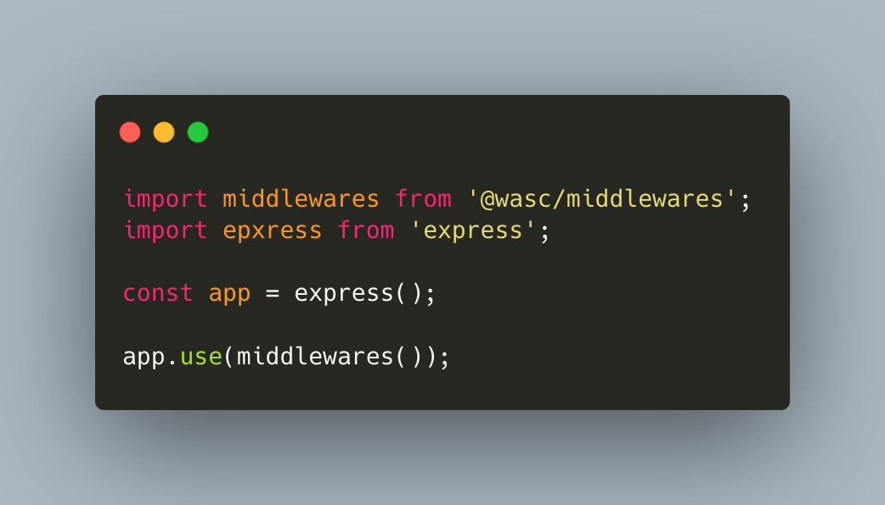

# Middlewares

# [](https://github.com/wasc-io/express-middlewares)

## Overview

[Middlewares](https://github.com/wasc-io/express-middlewares) is a simple wrapper around the required middlewares for an express app at [Wasc](https://wasc.io).

## Usage

Just like above:

```javascript
import middlewares from '@wasc/middlewares';
import express from 'express';

const app = express();

app.use(middlewares());
```

Import the module and use it. It works with CJS `require` as well.

## Included packages

- [Pino](https://github.com/pinojs/pino)
- [Helmet](https://github.com/helmetjs/helmet)
- [BodyParser](https://github.com/expressjs/body-parser) with configuration for json and urlencoded encoding
- [Cors](https://github.com/expressjs/cors)
- [ServiceVersion](https://github.com/wasc-io/service-version)

## Configuration

All the included modules are imported with standard options but you can customize them by passing in an object

```javascript
import middlewares from '@wasc/middlewares';
import express from 'express';

const app = express();

app.use(middlewares({
    cors: {
        origin: 'http://example.com,
    },
}));
```

All configuration options in the documentations of the modules are available. If you want to disable a certain module, just pass in false as an option:

```javascript
middlewares({
  cors: false,
});
```

The configurations are accessible via the names:

- `pino`
- `helmet`
- `validator`
- `bodyParserJson`
- `bodyParserUrl`
- `serviceVersion`
- `cors`

# Logger

To use the integrated logging function with the included request object write the following call:

```javascript
app.get('/', (request, response) => {
  try {
    // Some working
  } catch (error) {
    request.log.error(error);
  }
});
```

## Have fun coding!
